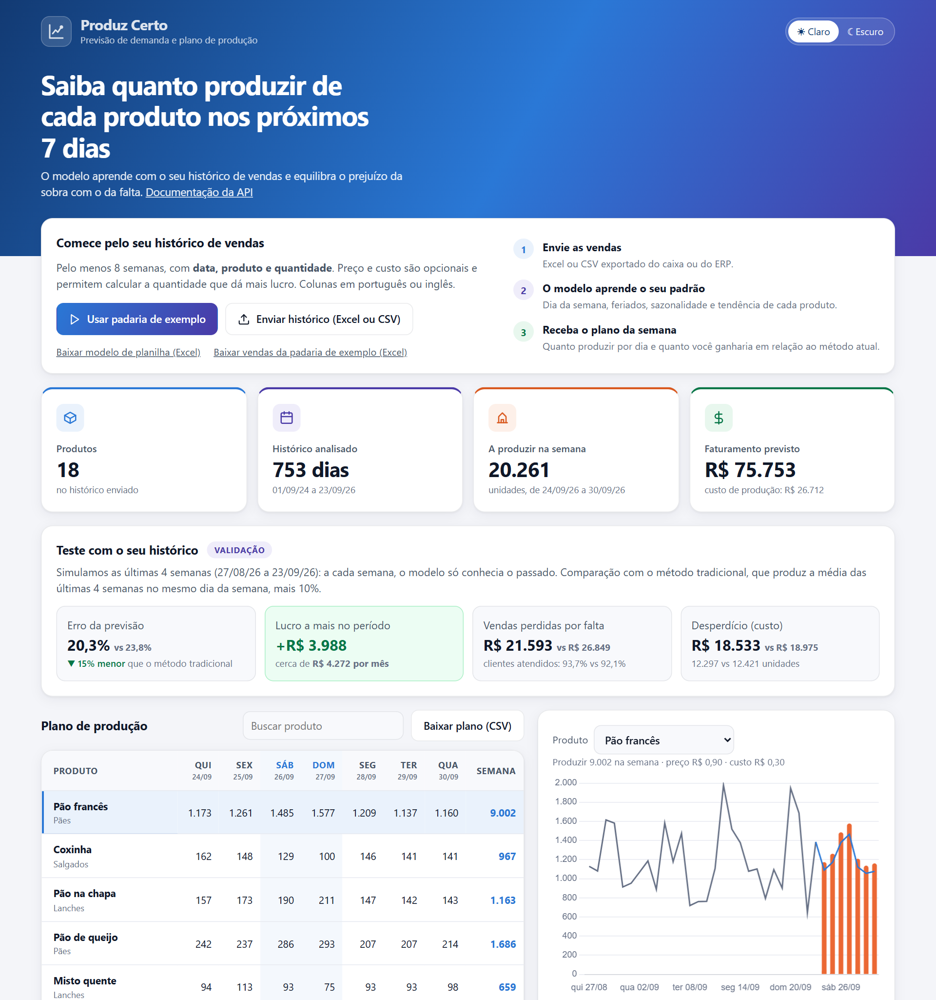
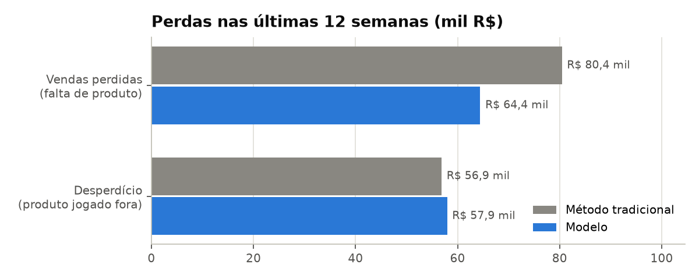
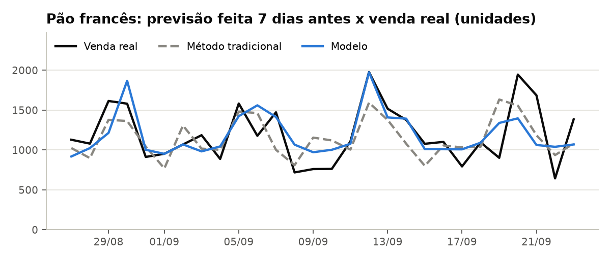
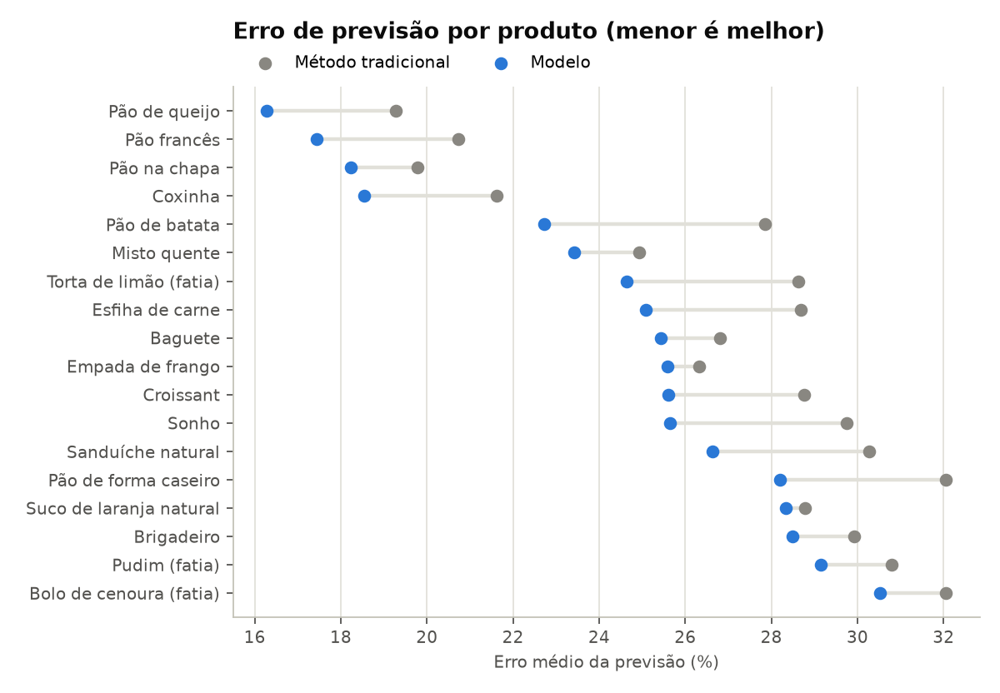
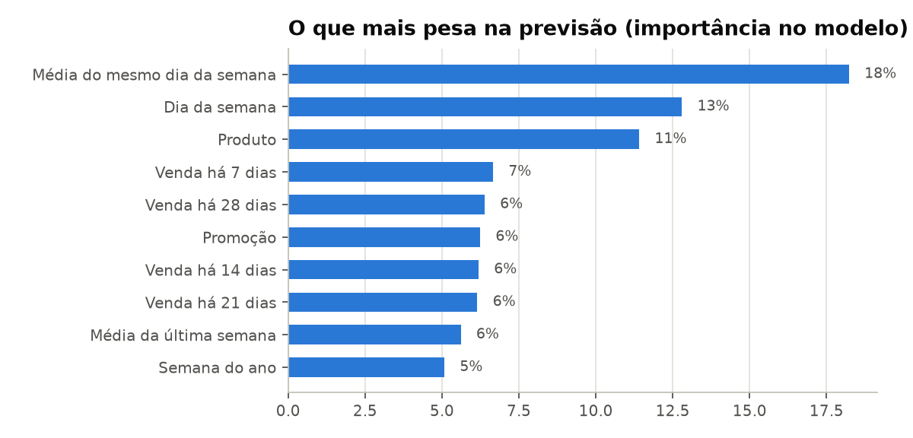

# 🥖 Produz Certo: previsão de demanda e plano de produção

Sistema que prevê as vendas dos próximos 7 dias de cada produto e recomenda **quanto produzir**, equilibrando o prejuízo da sobra (produto jogado fora) com o da falta (cliente que vai embora sem comprar). O modelo é **treinado com o histórico de vendas da própria empresa**, na hora em que ela envia a planilha.

**[🌐 Testar o app](https://previsao-demanda-qrkn.onrender.com)** · **[📖 Documentação da API](https://previsao-demanda-qrkn.onrender.com/docs)**

> Hospedado no plano gratuito do Render: se o app estiver parado, o primeiro acesso leva cerca de 1 minuto para carregar.



## O problema

Padarias, restaurantes e mercados decidem todo dia quanto produzir ou comprar. O método mais comum é repetir a média das últimas semanas e colocar uma margem "para garantir". O resultado são dois prejuízos ao mesmo tempo: **sobra** nos dias fracos e **falta** nos dias fortes, como véspera de feriado, fim de semana de verão ou dia de pagamento.

## Resultado

Teste nas **últimas 12 semanas** de uma padaria de exemplo com 18 produtos. A cada semana, o modelo só conhecia o passado e planejou os 7 dias seguintes, como seria na vida real. A comparação é com o método tradicional: média das últimas 4 semanas no mesmo dia da semana, mais 10%.

| | Método tradicional | Modelo |
|---|---:|---:|
| Erro da previsão | 23,4% | **20,6%** |
| Vendas perdidas por falta de produto | R$ 80,4 mil | **R$ 64,4 mil** |
| Clientes atendidos | 92,1% | **94,0%** |
| Desperdício (custo) | R$ 56,9 mil | R$ 57,9 mil |
| **Lucro bruto no período** | R$ 511,5 mil | **R$ 521,2 mil** |

São **R$ 9,7 mil a mais em 12 semanas**, cerca de **R$ 42 mil por ano** para uma única loja. O modelo erra menos que o método tradicional em **todos os 18 produtos**.




## Como funciona

**1. Um modelo para todos os produtos.** Um LightGBM prevê a venda de cada dia como proporção do nível recente do produto. Assim ele funciona para itens que vendem 20 ou 2.000 unidades por dia e aprende padrões comuns: dia da semana, feriados nacionais, véspera de feriado, fim de ano, sazonalidade, promoções e tendência. Todas as variáveis usam só informação de 7 ou mais dias antes, então uma única previsão planeja a semana inteira.



**2. Quantidade pelo lucro, não só pela previsão.** Quanto produzir é o clássico *problema do jornaleiro*: produzir a mais custa o produto jogado fora; produzir a menos custa a margem da venda perdida. O ponto ótimo é um quantil da previsão igual à **margem crítica** do produto, (preço − custo) / preço. Em itens de margem alta, como o pão francês (67%), vale produzir um pouco acima da previsão; em itens de margem baixa, um pouco abaixo. Os quantis vêm dos erros reais do modelo num período de calibração.

**3. Treinado com os dados de cada empresa.** O app treina o modelo com a planilha enviada, em cerca de 2 segundos, e testa o próprio modelo nas últimas 4 semanas daquele histórico, mostrando quanto a empresa teria ganho.



## Como uma empresa usa

1. **Exporta o histórico de vendas** do sistema de caixa ou ERP, em **Excel ou CSV**: uma linha por venda ou por produto e dia ([modelo de planilha](https://previsao-demanda-qrkn.onrender.com/modelo-planilha.xlsx)).
2. **Envia no app.** Obrigatórias: **data, produto e quantidade**. Opcionais: preço, custo, promoção e categoria. Colunas em português ou inglês, datas no formato brasileiro. Se alguma coluna tiver outro nome, o app pergunta qual é qual.
3. **Recebe o plano da semana:** quanto produzir de cada produto em cada dia, com gráfico do histórico e da previsão.
4. **Vê o teste com o próprio histórico:** erro da previsão e quanto teria ganho nas últimas semanas em relação ao método tradicional.
5. **Baixa o plano** para a equipe de produção.

## Tecnologia

| Componente | Tecnologia |
|---|---|
| Modelo | LightGBM global com variáveis de calendário (feriados do Brasil), defasagens e médias móveis |
| Decisão | Problema do jornaleiro com quantis empíricos calibrados por produto |
| Validação | Backtest semanal com janela deslizante (sem vazamento de dados do futuro) |
| API | FastAPI: `POST /planejar` e `POST /comparar` recebem Excel ou CSV |
| App web | HTML, JavaScript e Chart.js servidos pela própria API |
| Empacotamento e deploy | Docker, Render com deploy automático, GitHub Actions com testes |

## Limitações

- A padaria de exemplo tem **dados fictícios**, gerados com padrões realistas de varejo em Santos (SP): fim de semana, verão com turistas, feriados, Natal, dias de pagamento, promoções e chuva.
- O histórico mostra **vendas**, não a demanda real: num dia em que o produto acabou, a procura foi maior do que a venda registrada. Com o registro de rupturas, o modelo poderia corrigir isso.
- Clima e eventos locais não entram na previsão, e promoções futuras são consideradas desligadas.

## Como rodar localmente

```bash
python -m venv .venv
.venv/Scripts/activate            # no Linux/macOS: source .venv/bin/activate
pip install -r requirements.txt

PYTHONPATH=src python -m demanda.gerar_dados   # gera as vendas da padaria de exemplo
PYTHONPATH=src python -m demanda.avaliar       # backtest de 12 semanas, métricas e gráficos
uvicorn api.main:app --reload                  # app em http://localhost:8000
pytest                                         # testes
```

## Estrutura

```text
src/demanda/     geração dos dados de exemplo, modelo, leitura de planilhas e avaliação
api/             API FastAPI, app web e base de exemplo
reports/         métricas e gráficos
tests/           testes automatizados
```
